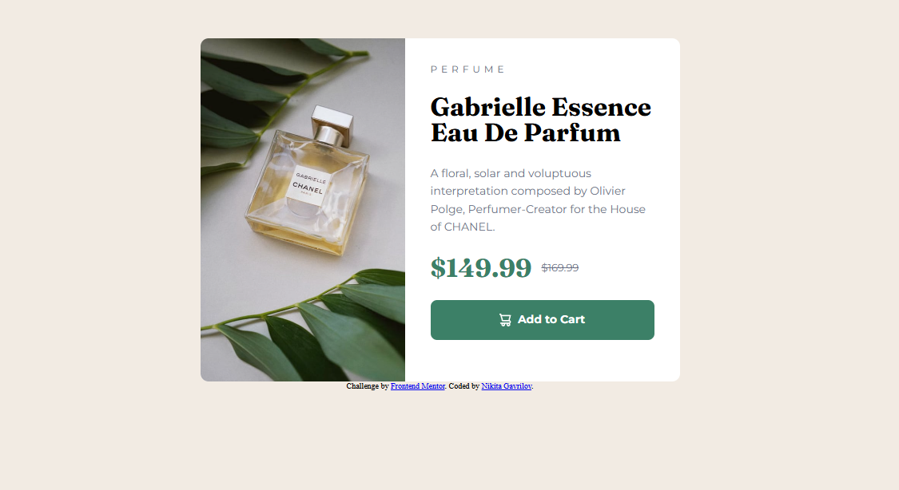

# Frontend Mentor - Product preview card component solution

This is a solution to the [Product preview card component challenge on Frontend Mentor](https://www.frontendmentor.io/challenges/product-preview-card-component-GO7UmttRfa). Frontend Mentor challenges help you improve your coding skills by building realistic projects.

## Table of contents

- [Overview](#overview)
  - [The challenge](#the-challenge)
  - [Screenshot](#screenshot)
  - [Links](#links)
- [My process](#my-process)
  - [Built with](#built-with)
  - [What I learned](#what-i-learned)
  - [Continued development](#continued-development)
  - [Useful resources](#useful-resources)
- [Author](#author)

## Overview

### The challenge

Users should be able to:

- View the optimal layout depending on their device's screen size
- See hover and focus states for interactive elements

### Screenshot




### Links

- Live Site URL: [gavrilov-n.github.io/product-preview-card-component](https://gavrilov-n.github.io/product-preview-card-component/)

## My process

### Built with

- Semantic HTML5 markup
- CSS custom properties
- Flexbox
- @media rule
- rem units

### What I learned

Learned how to change image depending on the screen size. Also learned how to use @media query rule to change the design of the webpage depending on the screen size. Also, started using `rem` sizing units instead of pixels.

```html
<picture>
        <source media="(max-width: 767px)" srcset="images/image-product-mobile.jpg">
        
</picture>
```

```css
@media (max-width: 768px){
    .card {
        max-width: 35rem;
        display: flex;
        flex-direction: column;
    }

    .card picture {
    width: 100%;
    height: 100%;
    display: block;
}


    .card picture img {
    width: 100%;
    height: 100%;
    display: block;
    object-fit: cover;
}
}
```

```CSS
html {
    font-size: 10px;
}
.product-overview {
    padding: 3.2rem;
}

.category, .product {
    margin-bottom: 2.4rem;
}
```

### Continued development

I'm not yet confortable with sizing images on the screen, also in sizing everyting in general.

## Author

- Website - [github.com/gavrilov-n](https://github.com/gavrilov-n)
- Frontend Mentor - [www.frontendmentor.io/home](https://www.frontendmentor.io/home)
- Twitter - [x.com/wakizasher](https://x.com/wakizasher)
